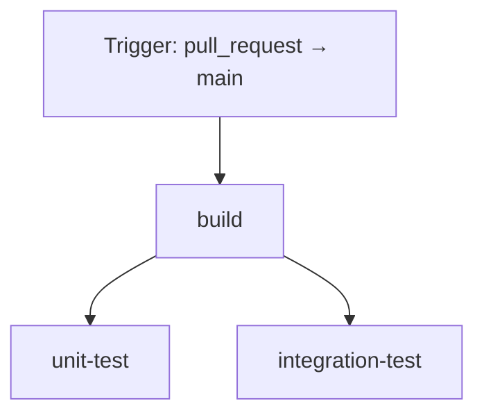
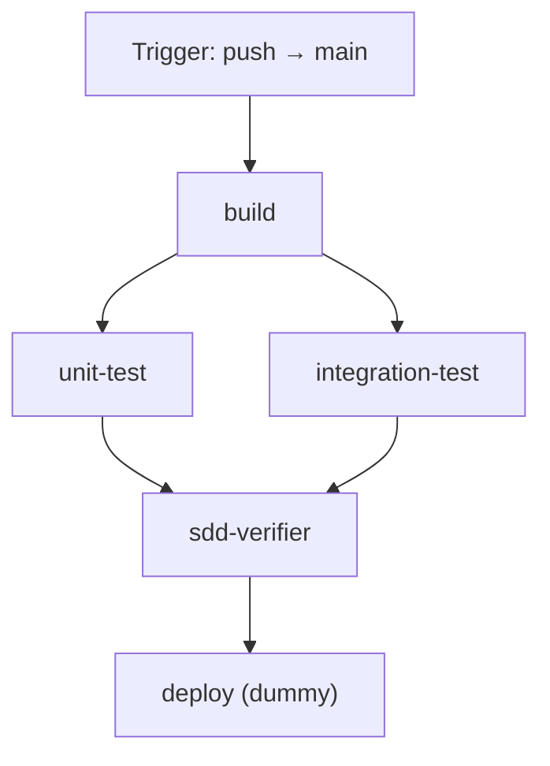

# Discount Agent SDD Demo

This project demonstrates **Spec-Driven Development (SDD)** using a simple
Discount Approval Agent in Python.

The goal is to show how an agent can stay aligned with business rules by
treating a written spec as the source of truth, then verifying behavior with
tests.

## What This Project Does

- Defines discount rules in a markdown spec.
- Implements an OpenAI-backed agent that reads the spec and returns JSON discount output.
- Runs scenario-based verification with pass/fail reporting and summary metrics.
- Emits structured JSON logs for monitoring and querying.

## Project Structure

- `specs/discount_logic.md`  
  Business rules and acceptance criteria.
- `agent.py`  
  `run_pricing_agent(customer_tier, order_total)`:
  - loads `specs/discount_logic.md` as source of truth
  - prompts OpenAI to return JSON in the form `{"discount": number}`
  - enforces safety cap (`$500`) and supports deterministic fallback
- `verifier.py`  
  Runs multiple scenarios and logs:
  - per-scenario status (`PASS` / `FAIL`)
  - expected vs actual discount
  - metrics summary (total run, passed, failed, pass rate, execution time)
- `logging_config.py`  
  Configures `structlog` JSON logs for console output.
- `pyproject.toml`  
  Source of truth for project dependencies.
- `requirements.lock`  
  Fully pinned dependency lock file for reproducible installs.
- `tests/conftest.py`  
  Shared pytest summary hook that prints unit/integration test case status.
- `tests/unit/test_agent_unit.py`  
  Unit tests for input validation, prompt building, and fallback behavior.
- `tests/integration/test_discount_agent_integration.py`  
  Integration tests for end-to-end pricing outcomes.

## Run Locally

From the project root:

```bash
python verifier.py
```

Expected output (example):

```text
Discount Approval Verification Report
==========================================================================================
# | Scenario                       | Tier     | Order Total | Expected | Actual | Status
--+--------------------------------+----------+-------------+----------+--------+-------
1 | VIP safety cap                 | VIP      | 3000.00     | 500.00   | 500.00 | PASS
2 | Gold threshold not met         | Gold     | 50.00       | 0.00     | 0.00   | PASS
...
------------------------------------------------------------------------------------------
Total: 6  Passed: 6  Failed: 0  Pass Rate: 100.0%  Time: 10.42 ms
Result: SUCCESS
```

Example failing output:

```text
Discount Approval Verification Report
==========================================================================================
# | Scenario                       | Tier     | Order Total | Expected | Actual | Status
--+--------------------------------+----------+-------------+----------+--------+-------
1 | VIP safety cap                 | VIP      | 3000.00     | 500.00   | 500.00 | PASS
2 | Gold threshold not met         | Gold     | 50.00       | 0.00     | 5.00   | FAIL
...
------------------------------------------------------------------------------------------
Total: 6  Passed: 5  Failed: 1  Pass Rate: 83.3%  Time: 11.20 ms
Result: FAILED
```

## OpenAI Setup (Full LLM Workflow)

Install dependencies:

```bash
python -m pip install -e ".[dev]"
```

For a fully reproducible install across machines (pinned versions):

```bash
python -m pip install -r requirements.lock
```

Set your API key (either shell env var or `.env` file):

```bash
# PowerShell
$env:OPENAI_API_KEY="your_api_key_here"
```

Or create a `.env` file in the project root:

```text
OPENAI_API_KEY=your_api_key_here
OPENAI_MODEL=gpt-4o-mini
PRICING_AGENT_FALLBACK=true
LOG_LEVEL=INFO
LOG_CONSOLE_ENABLED=false
LOG_FILE_ENABLED=true
LOG_FILE_PATH=logs/app.jsonl
```

Optional settings:

- `OPENAI_MODEL` (default: `gpt-4o-mini`)
- `AGENT_DISABLE_PAID_LLM` (default: `false`)  
  When `true`, never calls the OpenAI API; uses deterministic rules if
  `PRICING_AGENT_FALLBACK=true`. GitHub Actions sets this on PR/main pipelines
  so CI does not incur LLM cost.
- `PRICING_AGENT_FALLBACK` (default: `true`)  
  Set to `false` to fail fast when OpenAI is unavailable.
- `LOG_LEVEL` (default: `INFO`)  
  Set to `DEBUG`, `INFO`, `WARNING`, or `ERROR`.
- `LOG_CONSOLE_ENABLED` (default: `true`)  
  Enable/disable JSON logs on console (`verifier.py` sets this to `false` by default for clean table output).
- `LOG_FILE_ENABLED` (default: `true`)  
  Enable/disable writing logs to a file sink.
- `LOG_FILE_PATH` (default: `logs/app.jsonl`)  
  Path for JSONL structured log sink.

## Structured Logging

Most popular structured logger in Python: **`structlog`**.

This project writes structured logs to:

- console (stdout, if enabled)
- file sink: `logs/app.jsonl` (JSON lines)

Query examples:

```bash
# Query failed scenarios from file sink
rg "\"event\": \"scenario_evaluated\".*\"status\": \"FAIL\"" logs/app.jsonl

# Verification summary from file sink
rg "\"event\": \"verification_metrics\"" logs/app.jsonl
```

## Run Tests (Pytest)

Install once (if not already done):

```bash
python -m pip install -e ".[dev]"
```

Then run:

```bash
python -m pytest -v
```

Run only unit tests:

```bash
python -m pytest -v tests/unit
```

Run only integration tests:

```bash
python -m pytest -v tests/integration
```

Each run also prints a final **Test Status Summary** table with:

- suite (`unit` / `integration`)
- test case name
- status (`PASSED` / `FAILED`)

## Business-Friendly Test Report (Table)

If you want the readable table report (PASS/FAIL per scenario with summary
metrics), run:

```bash
python verifier.py
```

Use `pytest` commands for CI/automation checks, and `verifier.py` for
stakeholder-friendly console reporting.

Color output options:

- default: PASS in green, FAIL in red
- disable colors: set `NO_COLOR=1` or `REPORT_USE_COLOR=false`

## Dependency Lock File

This project includes a lock file generated from `pyproject.toml`:

- `requirements.lock` (runtime + dev dependencies, pinned)

Regenerate it after dependency changes:

```bash
python -m pip install pip-tools
python -m piptools compile pyproject.toml --extra dev -o requirements.lock
```

## GitHub Actions CI

There are two workflow files:

### `pull-request.yml`

Runs on **pull requests targeting `main`**:

1. `build` — install deps, build wheel, upload artifact (`dist-wheel-pr`)
2. `unit-test` (after `build`)
3. `integration-test` (after `build`)

No SDD verifier and no deploy job on PRs.

Test jobs set `AGENT_DISABLE_PAID_LLM=true` and `PRICING_AGENT_FALLBACK=true`
so **no paid OpenAI API calls** run on PRs.

#### Pull request pipeline diagram



### `ci-main-pipeline.yml`

Runs on **pushes to `main`** (for example, after a PR is merged):

1. `build`
2. `unit-test` (after `build`)
3. `integration-test` (after `build`)
4. `sdd-verifier` (after both test jobs pass) — `python verifier.py`
5. `deploy` — dummy placeholder (no target environment)

Unit, integration, and SDD verifier jobs use the same **no paid LLM** env as
PR workflows unless you change the YAML.

#### Main branch CI pipeline diagram



Each test job prints per-case status (see **Run Tests** above). The main
pipeline also surfaces failures from the SDD verifier or deploy stages.

## Why This Matters

Without a spec, AI-generated logic can drift or hallucinate.  
With SDD, the workflow becomes:

1. Write the rules in a spec.
2. Implement agent behavior against the spec.
3. Continuously verify outputs against acceptance criteria.

## Next Steps

1. **Expand `pytest` coverage further**
   - Add malformed input cases (`None`, negative totals, extra spaces, mixed case).
   - Validate response schema consistency for all paths.

2. **Tighten CI further**
   - Optional: spec checksum or branch protection rules on `main`.
   - Replace dummy deploy with a real step only after org approval.
